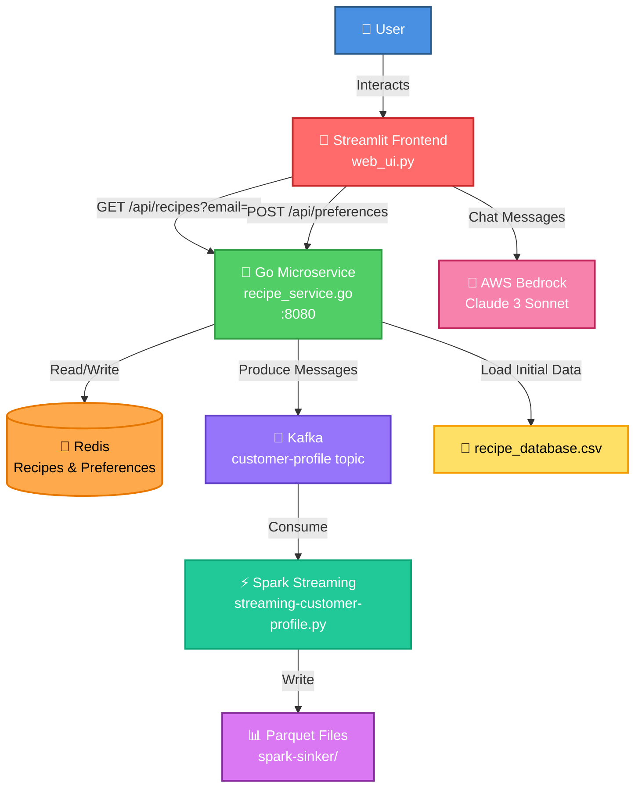

# Food Personalization App

A Streamlit web application for personalized recipe recommendations with a Golang microservice backend, integrated with Redis, Kafka, Spark Streaming, and AWS Bedrock AI chatbot.

## System Architecture



## Data Flow

1. **User Registration & Preferences**
   - User enters email and preferences in Streamlit UI
   - Preferences are sent to Go service via `POST /api/preferences`
   - Go service stores preferences in Redis (keyed by email)
   - Go service publishes preferences to Kafka topic `customer-profile`

2. **Recipe Retrieval**
   - User clicks "Show Recipes" in Streamlit
   - Streamlit calls `GET /api/recipes?email=user@example.com`
   - Go service fetches user preferences from Redis
   - Go service filters recipes from Redis based on preferences
   - Filtered recipes are returned to Streamlit for display

3. **Data Processing**
   - Spark Streaming job consumes messages from Kafka
   - Processes and writes customer profile data to Parquet files
   - Enables batch analytics and data lake integration

4. **AI Chatbot**
   - User interacts with chatbot in Streamlit
   - Messages are sent to AWS Bedrock (Claude 3 Sonnet)
   - AI can help users understand preferences and submit new ones
   - AI responds in special format to trigger preference submission

## Project Structure

```
food-personilization/
├── web_ui.py                    # Streamlit frontend application
├── recipe_service.go            # Golang microservice API
├── recipe_database.csv          # Recipe database (50+ recipes)
├── streaming-customer-profile.py # Spark streaming job
├── context.yml                  # AI chatbot context/prompts
├── requirements.txt             # Python dependencies
├── go.mod                       # Go module dependencies
├── .env                         # Environment variables (AWS, Kafka, Redis)
└── README.md                    # This file
```

## Prerequisites

- **Python 3.9+** with `venv`
- **Go 1.21+**
- **Docker** (for Kafka and Redis)
- **Java 11+** (for Spark)
- **AWS Account** with Bedrock access (for chatbot)

## Setup

### 1. Environment Variables

Create a `.env` file in the project root:

```bash
# AWS Bedrock
AWS_ACCESS_KEY_ID=your_access_key
AWS_SECRET_ACCESS_KEY=your_secret_key
AWS_REGION=eu-west-1

# Kafka
KAFKA_BROKERS=localhost:9092

# Redis
REDIS_ADDRESS=localhost:6379
```

### 2. Start Infrastructure Services

Start Kafka and Redis using Docker:

```bash
# Start Kafka (ensure Docker is running)
docker-compose up -d kafka zookeeper

# Start Redis
docker-compose up -d redis
# OR
docker run -d -p 6379:6379 redis:latest
```

### 3. Python Environment

1. Create and activate virtual environment:
```bash
python3 -m venv venv
source venv/bin/activate  # On Windows: venv\Scripts\activate
```

2. Install Python dependencies:
```bash
pip install -r requirements.txt
```

### 4. Golang Service

1. Ensure Go is installed (version 1.21 or later)

2. Initialize Go module (if not already done):
```bash
go mod init food-personalization
go mod tidy
```

3. Load recipes into Redis:
```bash
# First, start the Go service
go run recipe_service.go

# In another terminal, load recipes from CSV to Redis
curl -X POST http://localhost:8080/api/recipes/load
```

The service will start on `http://localhost:8080` by default.

You can set a custom port using the `PORT` environment variable:
```bash
PORT=3000 go run recipe_service.go
```

## Running the Application

### Start All Services

1. **Start the Golang microservice:**
```bash
go run recipe_service.go
```

2. **Start Spark Streaming (optional, for data processing):**
```bash
python streaming-customer-profile.py
```

3. **Start the Streamlit app:**
```bash
streamlit run web_ui.py
```

4. **Open your browser** to the URL shown in the Streamlit output (usually `http://localhost:8501`)

## API Endpoints

### GET /api/recipes

Returns filtered recipes based on user preferences stored in Redis.

**Query Parameters:**
- `email` (optional) - User email to fetch preferences from Redis

**Example:**
```bash
GET http://localhost:8080/api/recipes?email=user@example.com
```

**Response:**
```json
{
  "recipes": [
    {
      "name": "Margherita Pizza",
      "cuisine": "Italian",
      "description": "Classic pizza with tomato and mozzarella",
      "ingredients": "pizza dough;tomato sauce;mozzarella cheese;basil;olive oil",
      "price": 12.0,
      "time_to_cook": 25,
      "diet_type": "Vegetarian",
      "image_url": "https://..."
    }
  ],
  "count": 1
}
```

### POST /api/preferences

Stores user preferences in Redis and publishes to Kafka.

**Request Body:**
```json
{
  "email": "user@example.com",
  "diet_type": "Vegetarian",
  "cuisine": "Italian",
  "budget": 25.0,
  "allergies": ["Gluten", "Dairy"]
}
```

**Response:**
```json
{
  "status": "success",
  "message": "Preferences received",
  "preferences": { ... }
}
```

### POST /api/recipes/load

Loads recipes from CSV into Redis (one-time setup).

```bash
curl -X POST http://localhost:8080/api/recipes/load
```

### GET /health

Health check endpoint.

**Response:**
```json
{
  "status": "healthy"
}
```

## Features

- ✅ **Personalized Recipe Recommendations** - Filter recipes based on user preferences
- ✅ **User Preference Management** - Store and update preferences in Redis
- ✅ **Real-time Data Streaming** - Kafka integration for event-driven architecture
- ✅ **Data Lake Integration** - Spark Streaming writes to Parquet for analytics
- ✅ **AI-Powered Chatbot** - AWS Bedrock integration for intelligent assistance
- ✅ **Case-Insensitive Filtering** - Robust recipe matching
- ✅ **Pagination Support** - Efficient recipe browsing
- ✅ **Responsive Recipe Cards** - Beautiful UI with images and details
- ✅ **Express Tag** - Quick identification of fast recipes (≤15 minutes)
- ✅ **Modal View** - Detailed recipe information on click

## Development

### Testing the API

You can test the API using curl:

```bash
# Get all recipes (no email)
curl http://localhost:8080/api/recipes

# Get filtered recipes for a user
curl "http://localhost:8080/api/recipes?email=user@example.com"

# Submit preferences
curl -X POST http://localhost:8080/api/preferences \
  -H "Content-Type: application/json" \
  -d '{
    "email": "user@example.com",
    "diet_type": "Vegetarian",
    "cuisine": "Italian",
    "budget": 25.0,
    "allergies": ["Gluten"]
  }'
```

### Modifying Recipes

1. Update `recipe_database.csv` with new recipes
2. Reload recipes into Redis:
```bash
curl -X POST http://localhost:8080/api/recipes/load
```

### Debugging

The Go service includes detailed logging:
- Filtered recipes are printed with full details
- Preferences are logged when received
- Redis and Kafka operations are logged

Check the console output when running `go run recipe_service.go` for debugging information.

## Technology Stack

- **Frontend**: Streamlit (Python)
- **Backend**: Go (Golang)
- **Cache/Database**: Redis
- **Message Queue**: Apache Kafka
- **Stream Processing**: Apache Spark (PySpark)
- **AI/ML**: AWS Bedrock (Claude 3 Sonnet)
- **Data Storage**: CSV, Parquet files
- **Cloud**: AWS (Bedrock)

## License

MIT
